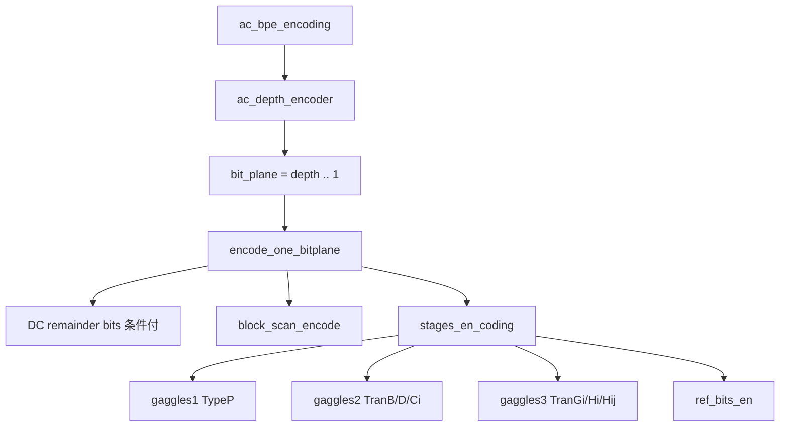

# AC ビットプレーン・ステージ符号化ガイド

<!-- story-nav:start -->

| | | |
|---|:---:|---|
| ← 前: [ブロックを森状に走査](block_scan_ja.md) | **学習ストーリー** · 第 9 / 11 章 · [入口](learn_ja.md) | 次: [途中で止まったとき](adjust_ja.md) → |

<!-- story-nav:end -->

## この章の結論

**AC は整数振幅の重いビットから、シンボルをガッグル単位で Rice 出力します。**

用語: [用語集](glossary_ja.md) · [walkthrough 章 5](walkthrough_ja.md)

## 絵で見る

```text
AC depth
  -> plane = max .. 1
       走査でシンボル作成
       -> gaggles1 -> 2 -> 3 -> refine
```

## 詳細

この文書は、DC 以外の **整数係数** を、振幅の重いビットから軽いビットへ送り、ガッグル単位で Rice 符号化する流れを説明します。

> **注意**: 浮動小数 DWT（`-t 0`）でも、ここの対象は丸め後の整数振幅です。
> IEEE 754 のビット列を上位から送っているわけではありません（[algorithm_ja.md](algorithm_ja.md) 参照）。

---

## 1. 全体流れ



`bit_depth_ac == 0` なら AC 符号化自体を省略します。

---

## 2. AC depth

プレーンループの前に、各ブロックの `bit_max_ac`（AC が何ビット目まで必要か）を送ります。

- depth=1: 1 bit/ブロック
- depth>1: DPCM 写像（`dpcm_ac_mapper`）→ ガッグル Rice（`select_rice_k`）

デコーダは `bit_max_ac < bit_plane` のブロックをスキップできます。

実装: [`src/ac/depth.rs`](../src/ac/depth.rs)

---

## 3. 1 プレーン: `encode_one_bitplane`

1. （条件満たすとき）DC 残差 `dc_remainder` の当該ビットを出力
2. `block_scan_encode` — シンボル / refine 累積
3. `stages_en_coding` — Rice + 符号 + refine 出力

`segment_full` になったら中断します。

---

## 4. ステージの 4 パス

`stages_en_coding`（[`orchestrate.rs`](../src/stages/orchestrate.rs)）は **ステージ跨ぎ** で全ガッグルを回します。

| 順 | 関数 | 内容 |
|------|------|------|
| A | `coding_options` + `stages_en_coding_gaggles1` | TypeP |
| B | `stages_en_coding_gaggles2` | TranB / TranD / TypeCi |
| C | `stages_en_coding_gaggles3` | TranGi / TranHi / TypeHij |
| D | `ref_bits_en` | 累積 refine ビット |

ガッグルサイズは `GAGGLE_SIZE = 16`。範囲分割は `gaggle_ranges`。

TypeP / TypeCi / TypeHij だけ符号ビットを伴い、遷移シンボルは Rice のみです。

---

## 5. デコード

| エンコード | デコード |
|------------|------------|
| `ac_bpe_encoding` | `ac_bpe_decoding` |
| `block_scan_encode` | （なし。ステージが係数へ直接書き戻す） |
| `stages_en_coding` | `stages_de_coding` |

レート制限では `rate_reached` 時に `stopped_stage` と停止座標（ブロック / x,y）を記録し、
後で `adjust_output`（[adjust_ja.md](adjust_ja.md)）が未確定係数を補正します。

---

## 6. ソース対応

| 役割 | 場所 |
|------|------|
| AC 入口 | `src/ac/bpe.rs` |
| AC depth | `src/ac/depth.rs` |
| オーケストラ | `src/stages/orchestrate.rs` |
| gaggles1..3 / refine | `src/stages/gaggles*.rs`, `refine.rs` |
| 共通 | `src/stages/common.rs` |

## 関連

- [block_scan_ja.md](block_scan_ja.md) / [rice_ja.md](rice_ja.md) / [dc_coding_ja.md](dc_coding_ja.md) / [adjust_ja.md](adjust_ja.md)

<!-- story-checkpoint:start -->

## この章のあとで分かること

- [ ] AC depth が何のためかを説明できる
- [ ] gaggles1→2→3→refine の順を言える
- [ ] レート制限で停止情報が残ることを知っている

満足したら、下の「次へ」へ進んでください。

<!-- story-checkpoint:end -->
<!-- story-nav:start -->

| | | |
|---|:---:|---|
| ← 前: [ブロックを森状に走査](block_scan_ja.md) | **学習ストーリー** · 第 9 / 11 章 · [入口](learn_ja.md) | 次: [途中で止まったとき](adjust_ja.md) → |

<!-- story-nav:end -->
