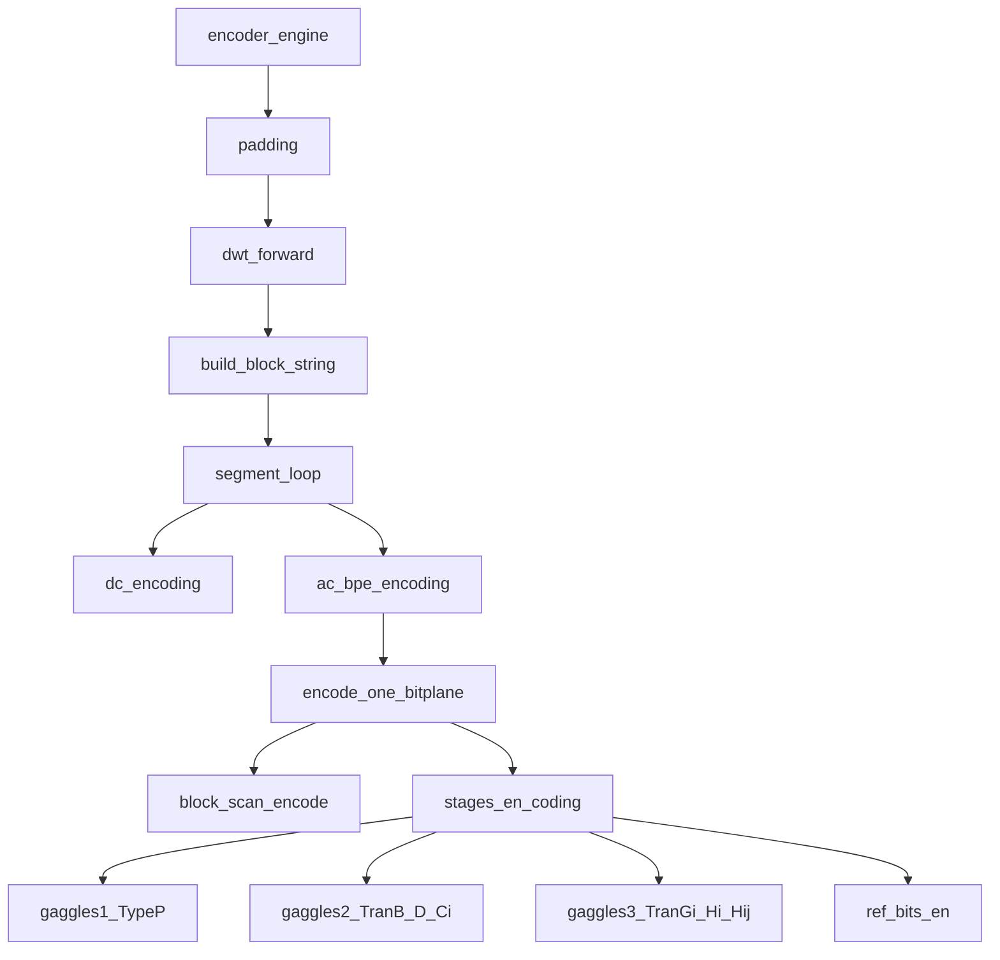
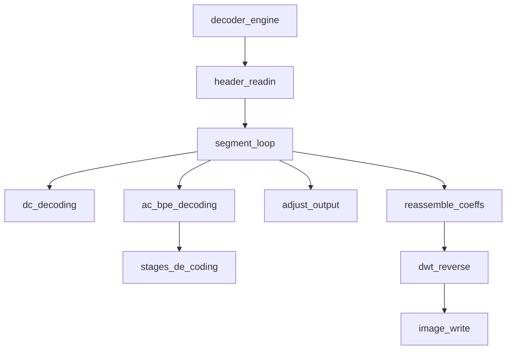

# BPE アルゴリズムガイド

<!-- story-nav:start -->

| | | |
|---|:---:|---|
| ← 前: [学習ストーリー（入口）](learn_ja.md) | **学習ストーリー** · 第 1 / 11 章 · [入口](learn_ja.md) | 次: [パイプラインの歩き方](steps_ja.md) → |

<!-- story-nav:end -->

## この章の結論

**BPE は、画像を周波数に分け、DC（大まかな明るさ）を先に、AC を重いビットから送る圧縮器です。**

用語: [用語集](glossary_ja.md) / [具体例](walkthrough_ja.md)

## 絵で見る

```text
画像
  -> パディング（8の倍数）
  -> DWT（周波数へ）
  -> 8x8 ブロック
  -> DC 先送  ->  AC（ビットプレーン）
  -> .bpe ファイル
```

## 詳細

この文書は、本リポジトリの **純 Rust 実装** がどのような順番で画像を圧縮・復元するかを、日本語で追えるようにしたものです。
細部の数式より「どの関数が何をするか」を優先しています。ソースを読むときの地図として使ってください。

対応する C 実装はリポジトリ直下の `original/source` です。Rust 側はビットストリーム互換を保つことを目的に移植されています。

---

## 全体のイメージ

BPE（Bit Plane Encoder）は、およそ次の流れです。

1. 画像を読み、8 の倍数になるよう端を埋める（パディング）

> **コラム**: なぜ 8 の倍数か→ 3 レベル DWT（\(2^3=8\)）と 8x8 ブロックが基本単位だから。詳細は [lifting97_ja.md](lifting97_ja.md) のコラム。
2. ウェーブレット変換（DWT）で周波数成分に分解する
3. 8×8 ブロックに並べ替える
4. セグメント単位で
   - **DC**（各ブロック左上の低周波係数）を符号化
   - **AC**（残り係数）を **ビットプレーン**（整数振幅の重いビットから）ごとに符号化
5. ビットストリームを書き出す

デコードはほぼ逆順です（ビットを読んで係数を復元 → 逆 DWT → 画像出力）。

---

## エンコードのマップ

GitHub / VS Code / Cursor など、Mermaid 対応のビューアで図が表示されます。



（図中の英名はソース上の関数名です。意味は下表・テキスト版を参照。）

テキスト版（同じ内容）:

```
encoder_engine
  ├─ 画像サイズ確認・パディング
  ├─ dwt_forward（ウェーブレット）
  ├─ build_block_string（8×8 ブロック列）
  └─ セグメントごと
       ├─ dc_encoding
       └─ ac_bpe_encoding
            └─ 各ビットプレーン
                 ├─ （必要なら）DC 残差ビット
                 ├─ block_scan_encode
                 └─ stages_en_coding
                      ├─ gaggles1（TypeP）
                      ├─ gaggles2（TranB / TranD / TypeCi）
                      ├─ gaggles3（TranGi / TranHi / TypeHij）
                      └─ ref_bits_en（リファインメント）
```

入口関数: [`src/encoder.rs`](../src/encoder.rs) の `encoder_engine`

---

## デコードのマップ



テキスト版:

```
decoder_engine
  ├─ header_readin
  └─ セグメントごと
       ├─ dc_decoding
       ├─ ac_bpe_decoding
       │    └─ stages_de_coding（gaggles1→2→3→refine）
       ├─ adjust_output（打ち切り時の係数補正）
       └─ バッファ flush
  ├─ 全セグメントの係数を画像に再配置
  └─ 逆 DWT → 出力
```

入口関数: [`src/decoder.rs`](../src/decoder.rs) の `decoder_engine`

---

## 各段階の役割（短い説明）

| 段階 | 主な場所 | 何をしているか |
|------|----------|----------------|
| パディング | `encoder.rs` | 幅・高さを 8 の倍数に揃える |
| DWT | `wavelet/` | 9/7 リフティングで周波数分解（整数／浮動小数） |
| ブロック化 | `encoder.rs` (`build_block_string`) | 変換後係数を 8×8 の列に並べ替え |
| DC 符号化 | `dc/` | ビット深度決定、量子化、DPCM、Rice 系エントロピー |
| AC depth | `ac/depth.rs` | 各ブロックの AC 最大ビット深度を符号化 |
| ブロック走査 | `block/` | 1 プレーン内で親子孫の有意性シンボルを作る |
| ステージ符号化 | `stages/` | ガッグル単位でシンボルを Rice 符号化し、最後に refine |
| パターン | `pattern/` | シンボル値のテーブル写像と符号化オプション選択 |
| 調整 | `adjust/` | レート制限で途中停止したときの係数補正（デコード） |

---

## AC のビットプレーンとは

ここで言うビットプレーンは、**整数係数の振幅** `|v|` を 2 進数で見たときの各ビット位です。
ループは、その最上位（最も重いビット）から下位へ進みます。

- あるプレーンで初めて「1」になった係数 → 有意性（significance）＋符号
- すでに有意だった係数 → リファインメントビット（そのプレーンの 0/1）

> **注意（浮動小数 DWT との関係）**
>
> `-t 0`（浮動小数 9/7）でも、BPE が見るのは **丸め後の整数係数** です（`round_away_from_zero`）。
> IEEE 754 の符号・指数・下位ビット列を上位から剥いているわけではありません。
> 「重いビット→軽いビット」は、その整数振幅に対する話です。

`ac_bpe_encoding` / `ac_bpe_decoding`（[`src/ac/bpe.rs`](../src/ac/bpe.rs)）が、このループの司令塔です。

---

## ステージ（gaggles）の意味

ブロック走査で作ったシンボルは、すぐに全部書くのではなく、**種類ごとにまとめて**（ガッグル＝最大 16 ブロック）符号化します。

| ファイル | シンボルの種類 |
|----------|----------------|
| `stages/gaggles1.rs` | TypeP（親係数） |
| `stages/gaggles2.rs` | TranB / TranD / TypeCi（子孫への遷移と子） |
| `stages/gaggles3.rs` | TranGi / TranHi / TypeHij（孫） |
| `stages/refine.rs` | リファインメントビット |
| `stages/orchestrate.rs` | 上記を 1→2→3→refine の順で実行 |

オーケストレーション: [`src/stages/orchestrate.rs`](../src/stages/orchestrate.rs)

---

## モジュールとソース対応

| 関心 | ディレクトリ / ファイル | 元の C（目安） |
|------|-------------------------|----------------|
| 全体エンジン | `encoder.rs`, `decoder.rs` | `bpe_encoder.c`, `bpe_decoder.c` |
| DC | `dc/` | `DC_EnDeCoding.c` |
| AC | `ac/` | `AC_BitPlaneCoding.c` |
| ブロック走査 | `block/` | `BPEBlockCoding.c` |
| ステージ | `stages/` | `StagesCodingGaggles.c` |
| パターン | `pattern/` | `PatternCoding.c` |
| Rice | `rice/` | `ricecoding.c` |
| ウェーブレット | `wavelet/` | `lifting_97*.c`, `CoeffGroup.c` |
| ヘッダ / ビット I/O | `header.rs`, `bitstream/` | `header.c`, `bitsIO.c` |

「1 ファイルに encode と対になる decode を置く」方針で整理されています（例: `dc/entropy.rs`, `stages/gaggles2.rs`）。

---

## 学習のおすすめ順

**物語として読むなら** [学習ストーリー（learn_ja.md）](learn_ja.md) から始めてください。各文書に「前へ / 次へ」があります。

ソース中心で追うときの目安:

1. この文書のマップで全体像をつかむ
2. `encoder_engine` → `dc_encoding` → `ac_bpe_encoding` を上から読む
3. 1 ビットプレーンについて `block_scan_encode` と `stages_en_coding` を追う
4. デコード側で同じシンボルがどう係数に戻るかを見る
5. 必要なら `scripts/golden_test.ps1` で C 実装とのバイト一致を確認する

---

## 関連リンク

- 具体例（初心者必読）: [walkthrough_ja.md](walkthrough_ja.md)
- 学習ストーリー: [learn_ja.md](learn_ja.md)
- 段階ごとのステップ解説: [steps_ja.md](steps_ja.md)
- 9/7 リフティング詳解: [lifting97_ja.md](lifting97_ja.md)
- 実装読解ガイド（ソースの地図）: [code_reading_ja.md](code_reading_ja.md)
- Rice 符号化詳解: [rice_ja.md](rice_ja.md)
- DC 符号化: [dc_coding_ja.md](dc_coding_ja.md)
- ブロック走査: [block_scan_ja.md](block_scan_ja.md)
- AC ステージ: [ac_stages_ja.md](ac_stages_ja.md)
- 係数補正: [adjust_ja.md](adjust_ja.md)
- ヘッダ / ビットストリーム: [header_bitstream_ja.md](header_bitstream_ja.md)
- 係数並べ替え: [coeff_group_ja.md](coeff_group_ja.md)
- このソースでの検証手順: [verify_ja.md](verify_ja.md)
- リポジトリ概要・ビルド手順: [README.md](../README.md)
- 互換テスト: `scripts/golden_test.ps1`

<!-- story-checkpoint:start -->

## この章のあとで分かること

- [ ] エンコードの大まかな順（パディング→DWT→ブロック→DC→AC）を説明できる
- [ ] デコードがほぼ逆順であることが分かる
- [ ] gaggles1/2/3 と refine が AC の一部だと知っている

満足したら、下の「次へ」へ進んでください。

<!-- story-checkpoint:end -->
<!-- story-nav:start -->

| | | |
|---|:---:|---|
| ← 前: [学習ストーリー（入口）](learn_ja.md) | **学習ストーリー** · 第 1 / 11 章 · [入口](learn_ja.md) | 次: [パイプラインの歩き方](steps_ja.md) → |

<!-- story-nav:end -->
