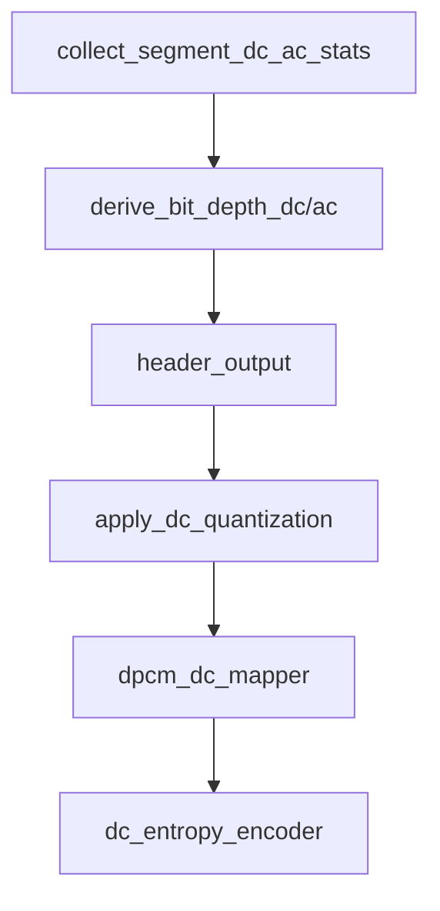

# DC 符号化ガイド

<!-- story-nav:start -->

| | | |
|---|:---:|---|
| ← 前: [ビットの入れ物](header_bitstream_ja.md) | **学習ストーリー** · 第 6 / 11 章 · [入口](learn_ja.md) | 次: [共通の圧縮道具（Rice）](rice_ja.md) → |

<!-- story-nav:end -->

## この章の結論

**DC は「ぼやけた画」を先に送るために、量子化→差分（DPCM）→Rice する。**

用語: [用語集](glossary_ja.md) · [walkthrough 章 4](walkthrough_ja.md)

## 絵で見る

```text
DC値 --q--> shifted --DPCM--> mapped --Rice--> ビット
                 （低位は残差）
```

## 詳細

この文書は、各 8x8 ブロックの左上（LL）係数をセグメント単位で送る **DC 系パイプライン** を説明します。

Rice 出力段の詳細は [rice_ja.md](rice_ja.md) を参照してください。

---

## 1. エンコード順（`dc_encoding`）



1. **統計** — `dc_min`/`dc_max`、`max_ac_segment`、各ブロック `bit_max_ac`
2. **ビット深度** — `derive_bit_depth_dc` / `derive_bit_depth_ac` をヘッダへ
3. **ヘッダ** — [header_bitstream_ja.md](header_bitstream_ja.md)
4. **量子化** — `q` を決め、2 の補数化後に右シフト
5. **DPCM 写像** — 差分を非負整数 `mapped_dc` へ
6. **エントロピー** — ガッグルごとに `k` を選び出力

> **コラム**: 「エントロピー」は物理の乱雑さではなく、情報理論の下限 H に近づける符号化の意味です。命名の理由は [entropy_coding_ja.md](entropy_coding_ja.md)。

`n == 1` のときは DPCM を省き、1 bit 直接出力します。

---

## 2. 量子化係数 `q`

`quantization_factor_q_prime(bit_depth_dc, bit_depth_ac)`:

| 条件 | `q'` |
|------|------|
| `bit_depth_dc <= 3` | 0 |
| `dc - (1 + ac/2) <= 1` | `dc - 3` |
| 差 > 10 | `dc - 10` |
| その他 | `1 + ac/2` |

整数 DWT では `q = max(q', custom_wt_ll3)`。

`apply_dc_quantization`:

```text
twos = conv_twos_comp(dc, bit_depth_dc)
shifted_dc = twos >> q
dc_remainder = twos & ((1<<q) - 1)
n = max(bit_depth_dc - q, 1)
```

低位 `q` ビットは残差として残し、条件により AC プレーンや追加プレーンで送ります。

---

## 3. DPCM 写像

- 先頭ブロック: `mapped_dc = shifted_dc`（生）
- 以降: `diff = cur - prev` を `theta` 基準の zigzag で非負化

逆写像は `dpcm_dc_demapper`。単体テストが往復を保証します。

---

## 4. デコード（`dc_decoding`）

1. `q` / `n` 再計算
2. `dc_entropy_decoder` → `dpcm_dc_demapper`
3. `read_additional_dc_bitplanes`（`q > bit_depth_ac` 時）
4. `dequantize_dc`（左シフト + `deconv_twos_comp`）

---

## 5. ソース対応

| 役割 | ファイル |
|------|----------|
| オーケストラ | `src/dc/coding.rs` |
| 2 の補数 | `src/dc/twos_comp.rs` |
| DPCM | `src/dc/dpcm.rs` |
| エントロピー | `src/dc/entropy.rs` |
| C 参照 | `DC_EnDeCoding.c` |

## 検証

```powershell
cargo test dc::
```

<!-- story-checkpoint:start -->

## この章のあとで分かること

- [ ] `q` が何を決めるかを説明できる
- [ ] DPCM 写像がなぜ必要かを言える
- [ ] デコードが逆順で DC を戻す流れが分かる

満足したら、下の「次へ」へ進んでください。

<!-- story-checkpoint:end -->
<!-- story-nav:start -->

| | | |
|---|:---:|---|
| ← 前: [ビットの入れ物](header_bitstream_ja.md) | **学習ストーリー** · 第 6 / 11 章 · [入口](learn_ja.md) | 次: [共通の圧縮道具（Rice）](rice_ja.md) → |

<!-- story-nav:end -->
