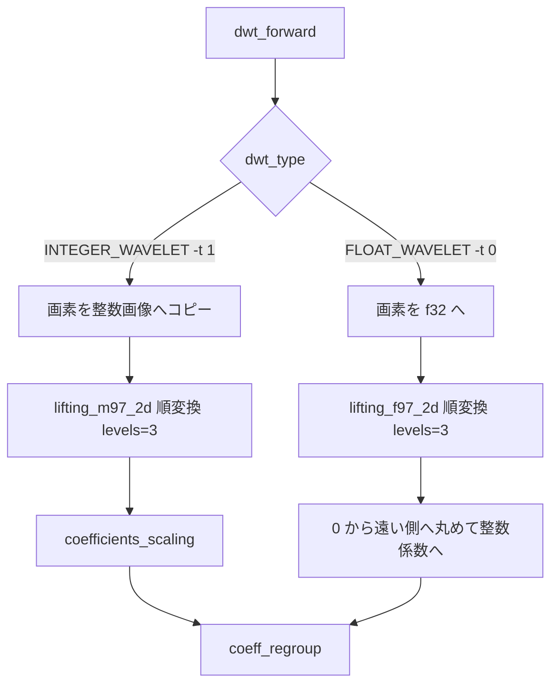

# 9/7 リフティング（ウェーブレット変換）ガイド

<!-- story-nav:start -->

| | | |
|---|:---:|---|
| ← 前: [パイプラインの歩き方](steps_ja.md) | **学習ストーリー** · 第 3 / 11 章 · [入口](learn_ja.md) | 次: [8x8 の木に組む](coeff_group_ja.md) → |

<!-- story-nav:end -->

## この章の結論

**DWT は画像を「平均（LL）と差（HL/LH/HH）」に分け、小さい差を多くして圧縮しやすくします。**

用語: [用語集](glossary_ja.md) · [walkthrough](walkthrough_ja.md)

## 絵で見る

```text
[画素] --1D行--> [近似|詳細] --1D列-->
  +----+----+
  | LL | HL |
  +----+----+
  | LH | HH |
  +----+----+
  （これを LL に対し 3 回）
```

## 詳細

この文書は、BPE の前段である **9/7 離散ウェーブレット変換（DWT）** を、本リポジトリの実装に沿って説明します。
「何をする変換か」「整数版と浮動小数版の違い」「どの関数を読むか」を追えるようにしてあります。

全体パイプラインでの位置づけは [algorithm_ja.md](algorithm_ja.md) / [steps_ja.md](steps_ja.md) を参照してください。

---

## 1. なぜウェーブレット変換をするのか

BPE は画素そのものではなく、**周波数に分けた係数** をビットプレーン符号化します。

| 成分 | 意味 | 圧縮との関係 |
|------|------|--------------|
| 低周波（近似） | 画像の大まかな形 | 値が大きく、少ない係数で多くを表す |
| 高周波（詳細） | エッジや細かい変化 | 多くの場所で 0 に近く、符号化しやすい |

1 次元の信号を半分の長さの「粗い列」と「細かい列」に分ける操作を、行・列に繰り返し適用します。

---

## 2. 「9/7」と「リフティング」の意味

### 9/7

フィルタのタップ数の通称です。

- 低周波側（近似）: 9 点の係数
- 高周波側（詳細）: 7 点の係数

JPEG 2000 でも使われる **CDF 9/7** 系と同系統です。このリポジトリでは `-t` で「9/7 を使うか否か」を選ぶのではなく、**同じ 9/7 をどの演算精度で実装するか** を選びます。

| CLI | 定数 | 実装 | 性質 |
|-----|------|------|------|
| `-t 1`（既定） | `INTEGER_WAVELET` | `lifting97i.rs` | 整数リフティング。変換自体は可逆 |
| `-t 0` | `FLOAT_WAVELET` | `lifting97f.rs` | 実数フィルタ。変換だけで微小誤差が出る |

### リフティング

畳み込みフィルタをそのまま計算する代わりに、**予測（predict）と更新（update）を交互に行う** 形式です。
整数版はこの形で丸めを入れ、整数→整数の可逆変換にしています。
浮動小数版は本実装では対称フィルタの畳み込み形で書いていますが、扱うフィルタ族は同じ 9/7 です。


---

## 3. パイプライン上の入口

エンコード時は `dwt_forward` が入口です（[`src/wavelet/mod.rs`](../src/wavelet/mod.rs)）。



デコード側は概ね逆順です。

- 整数: `coefficients_rescaling` → `lifting_m97_2d(..., inverse=true)`
- 浮動小数: `f32` に戻して `lifting_f97_2d(..., inverse=true)` → 必要なら再丸め

本実装の分解段数は **3 レベル固定** です（`levels = 3`）。
そのため画像の幅・高さは、パディング後に 8 の倍数である必要があります（エンコーダが端を埋めて満たします）。

---

### コラム: なぜ幅・高さを 8 の倍数にするのか

本の余白によく出てくる「ひと息」です。パイプラインの最初で端を埋める理由は、たった 2 つです。

**1. DWT を 3 回やると、1/8 になる**

1 レベルごとに縦横がそれぞれ半分になります。BPE はこれを **3 レベル固定** で行うので、最深部の LL3 は元画像の \(1/8 \times 1/8\) になります。
\(2^3 = 8\) なので、割り切れないと「半分」が整数にならず、係数の対応が崩れます。

**2. 8x8 ブロックが「1 場所の全周波数」だから**

並べ替え後の 8x8 は、LL3(1) + 親(3) + 子(12) + 孫(48) = 64 係数で構成されます。
この「親 1 : 子 4 : 孫 16」の木が欠けなく作れるのも、各レベルの解像度が正確に 2 倍ずつ違うときだけです。

**埋め方**: 端の行・列を **複製** して埋めます（急な段差を作らないため）。復号時はヘッダの `pad_rows_3bits` で複製分を捨てます。

詳しい配置は [coeff_group_ja.md](coeff_group_ja.md)、DWT の段数はこの文書の「パイプライン上の入口」を参照してください。

---

## 4. 2 次元・多段の進め方

1 回の 2D 変換は次の順です（整数・浮動小数とも同じ骨格）。

1. **各行**に 1D 順変換（水平）
2. **各列**に 1D 順変換（垂直）

これをレベル 0, 1, 2 と繰り返し、毎回「今の LL（左上の粗い部分）」だけをさらに分解します。

```text
レベル 0 後:
+------+------+
| LL1  | HL1  |
+------+------+
| LH1  | HH1  |
+------+------+

レベル 1 後（LL1 だけ再分割）:
+----+----+------+
|LL2 |HL2 |      |
+----+----+ HL1  |
|LH2 |HH2 |      |
+----+----+------+
|    LH1  | HH1  |
+---------+------+
```

最終的に LL3 / HL3 / LH3 / HH3 … HH1 といった帯域が並び、その後 `coeff_regroup` で BPE が扱いやすい並びに組み替えます。

逆変換は **レベルを降順**に、かつ各レベルで **列 → 行**（順変換の逆順）です。

---

## 5. 整数 9/7（`-t 1`）— 1D 順変換

実装: [`forward_lifting97i`](../src/wavelet/lifting97i.rs)

長さ `n`（偶数）の整数列を、長さ `n/2` の近似 `r` と詳細 `d` に分け、

```text
x <- [ r[0..n/2), d[1..=n/2] ]
```

の順で書き戻します（詳細はインデックス 1 から詰める実装です）。

### ステップ

1. **対称拡張**  
   端の外側を内側の鏡像で埋める（パッド幅 `F_EXTPAD = 4`）。フィルタが端でも参照できるようにするためです。

2. **詳細（奇数位置まわり）**  
   偶数サンプルから奇数サンプルを予測し、残差を `d` とします。

```text
t = -1/16 * (x[i-4] + x[i+2]) + 9/16 * (x[i-2] + x[i]) + 1/2
d = x[i-1] - floor_C(t)
```

3. **近似（偶数位置まわり）**  
   隣り合う詳細から偶数サンプルを更新します。

```text
t = -1/4 * (d[k] + d[k+1]) + 1/2
r = x[2k] - floor_C(t)
```

`floor_C` は `floor_toward_neg_inf_from_temp` です。
正なら切り捨て、負で非整数なら「より小さい整数側」へ寄せる、C の `(int)` キャスト相当の丸めです。
この丸め込みのおかげで **順変換 → 逆変換がビット単位で一致** します。

### 1D 逆変換のイメージ

[`inverse_lifting97i`](../src/wavelet/lifting97i.rs) は上記の更新・予測を **逆順・符号反転（加算）** で戻し、
最後に偶奇サンプルをインターリーブして元の並びに戻します。

---

## 6. 浮動小数 9/7（`-t 0`）— 1D 順変換

実装: [`forward_lifting97f`](../src/wavelet/lifting97f.rs)

整数版のような predict/update 丸めではなく、**対称な低域・高域フィルタ係数**を畳み込みます。

- `LOW_PASS_FILTER`（9 点）→ 低周波
- `HIGH_PASS_FILTER`（7 点）→ 高周波

中心を `filter[4]` / `filter[3]` に合わせ、左右対称に足し合わせます。出力は

```text
x <- [ 低周波[0..n/2), 高周波[0..n/2) ]
```

です。

逆変換 [`inverse_lifting97f`](../src/wavelet/lifting97f.rs) は、対応する合成係数で偶奇サンプルを再構成します。
実数演算のため **完全一致は保証されず**、ユニットテストでは絶対誤差 1e-2 程度を許容しています。

さらにエンコードでは、浮動小数変換の結果を整数係数に丸めてから BPE に渡します（`round_away_from_zero`）。ここでも情報が落ちます。
後続の AC ビットプレーンは、この **丸め後の整数振幅** に対して行われます（IEEE 754 のビット列ではありません）。

---

## 7. ソース対応表

| 役割 | 関数 / ファイル |
|------|-----------------|
| 入口（符号化） | `dwt_forward` — `src/wavelet/mod.rs` |
| 入口（復号） | `dwt_reverse` / `dwt_reverse_floating` |
| 整数 1D / 2D | `forward_lifting97i` / `inverse_lifting97i` / `lifting_m97_2d` — `lifting97i.rs` |
| 浮動小数 1D / 2D | `forward_lifting97f` / `inverse_lifting97f` / `lifting_f97_2d` — `lifting97f.rs` |
| 帯域スケール | `coefficients_scaling` / `coefficients_rescaling` — `mod.rs` |
| 係数の並び替え | `coeff_regroup` など — `coeff_group.rs` |
| C 参照 | `original/source/lifting_97M.c`, `lifting_97f.c`, `waveletbpe.c` |

---

## 8. どう検証するか

### ユニットテスト（変換単体）

```powershell
cd rust
$env:CARGO_TARGET_DIR = "$PWD\target"
cargo test lifting97
```

見ていること:

- 整数 1D / 2D が完全可逆
- 平坦信号では詳細帯が 0
- 浮動小数は許容誤差内で復元
- `levels` に合わないサイズはエラー

### パイプラインでの可逆性

`-t 1` かつレート無制限（`-r 0`）なら、変換＋BPE 全体でも画素が一致しやすいです。

```powershell
cargo test --test pipeline_roundtrip integer_wavelet_without_rate_limit_is_lossless
```

### C とのバイト一致

```powershell
.\scripts\golden_test.ps1
```

ケース `int_r0` / `int_r1` が `-t 1`、`float_r1` が `-t 0` です。

---

## 9. よくある誤解

| 誤解 | 実際 |
|------|------|
| `-t` は「変換するかしないか」 | 変換は常に行う。整数実装か浮動小数実装かの選択 |
| 整数 9/7 なら常に可逆圧縮 | 変換は可逆でも、`-r` でビットを切ると画像は不可逆 |
| 浮動小数 9/7 は可逆 | 変換と丸めの段階で誤差が出る |
| リフティング＝このリポジトリ独自の発明 | 標準的な手法。ここでの式は C 参照実装に合わせたもの |

---

## 関連リンク

- 全体マップ: [algorithm_ja.md](algorithm_ja.md)
- 段階ステップ: [steps_ja.md](steps_ja.md)
- 係数並べ替え: [coeff_group_ja.md](coeff_group_ja.md)
- Rice 符号化: [rice_ja.md](rice_ja.md)
- 検証手順: [verify_ja.md](verify_ja.md)
- README: [../README.md](../README.md)

<!-- story-checkpoint:start -->

## この章のあとで分かること

- [ ] なぜ DWT を先に行うかを説明できる
- [ ] 整数 9/7 と浮動小数 9/7 の違いを言える
- [ ] 2D・多段で LL がどう細くなるかが分かる

満足したら、下の「次へ」へ進んでください。

<!-- story-checkpoint:end -->
<!-- story-nav:start -->

| | | |
|---|:---:|---|
| ← 前: [パイプラインの歩き方](steps_ja.md) | **学習ストーリー** · 第 3 / 11 章 · [入口](learn_ja.md) | 次: [8x8 の木に組む](coeff_group_ja.md) → |

<!-- story-nav:end -->
