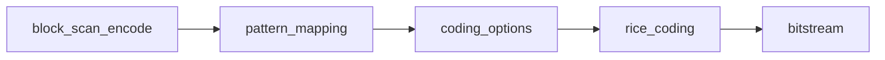

# Rice 符号化ガイド

<!-- story-nav:start -->

| | | |
|---|:---:|---|
| ← 前: [まず大まかな明るさ（DC）](dc_coding_ja.md) | **学習ストーリー** · 第 7 / 11 章 · [入口](learn_ja.md) | 次: [ブロックを森状に走査](block_scan_ja.md) → |

<!-- story-nav:end -->

## この章の結論

**Rice は小さい数を短く書く道具で、DC 用（k 付き）と AC シンボル用（固定表）の 2 種があります。**

用語: [用語集](glossary_ja.md)

## 絵で見る

```text
v=5, k=2
  q = 5>>2 = 1 , r = 5&3 = 1
  出力 ≈ (1が q+1 個) + (r を k bit)
```

## 詳細

この文書は、BPE で使う **Rice 系のエントロピー符号化** を、本リポジトリの実装に沿って説明します。

> **コラム — なぜ「エントロピー符号化」と呼ぶのか？**
>
> 情報理論のエントロピー H は「平均でこれ以下には縮められない」という **理論下限** です。
> その下限に近づける符号化の総称がエントロピー符号化で、Rice はその一種です。
> 物理の「乱雑さ」とは測る対象が違います。詳しくは [entropy_coding_ja.md](entropy_coding_ja.md) を参照してください。

重要: このコーデックには **2 種類の「Rice」** があります。名前は似ていますが、役割も API も異なります。

| 種類 | 主な用途 | 主要 API |
|------|----------|-----------|
| A. シンボル用固定符号表 | AC ビットプレーンのパターンシンボル（1〜4 bit） | `rice_coding` / `rice_decoding` |
| B. パラメータ `k` 付き Golomb-Rice | DC（および AC depth）の写像値 | `select_rice_k` + `dc_entropy_*` |

全体での位置づけは [algorithm_ja.md](algorithm_ja.md) / [steps_ja.md](steps_ja.md) を参照してください。

---

## 1. Rice 符号のイメージ（一般論）

典型的な Golomb-Rice は、非負整数 \(v\) をパラメータ \(k\) で次のように割ります。

```text
q = v >> k          # 商
r = v & ((1<<k)-1)  # 余り
出力 = (ユニタリ: 1 を q+1 個) + (r を k ビット)
```

小さい \(v\) が多いときは短いコードになり、大きい \(v\) が多いときは \(k\) を大きくするか、そのまま無符号（raw）で送るほうが有利になります。

BPE では:

- **DC** は上記に近い形（種類 B）
- **AC シンボル** はアルファベットが最大 16 通り（4 bit）と小さいので、**事前定義の複数符号表**から最安のものを選ぶ形（種類 A）

---

## 2. 種類 A: AC シンボル用 `rice_coding`

### 位置づけ



1. ブロック走査が `sym_val` / `sym_len` を作る
2. `pattern_mapping` が `sym_mapped_pattern` に変換（出現頻度に有利な番号へ）
3. `coding_options` がガッグル内のコストから `option[0..3]` を決める
4. `rice_coding(coding, mapped, sym_len, option)` がビット列を出力

### 引数

| 引数 | 意味 |
|------|------|
| `input_val` | 写像済みパターン（`sym_mapped_pattern`） |
| `bit_length` | シンボル長（1〜4、または 0） |
| `option[0]` | 2-bit シンボル用の表番号 |
| `option[1]` | 3-bit シンボル用の表番号 |
| `option[2]` | 4-bit シンボル用の表番号 |

`bit_length == 0` は何も出さない、`1` は 1 ビットそのまま出力です。

### オプションの意味（概要）

各 `bit_length` ごとに複数の符号表があり、オプションで切り替えます。

| `bit_length` | 有効オプション | 性格 |
|--------------|----------------|------|
| 2 | `option[0]=0` | 小さい値を短いユニタリ風に |
| 2 | `option[0]=1` | 2 ビット固定（無符号的） |
| 3 | `option[1]=0,1,3` | 0/1 は変長、3 は 3 ビット固定 |
| 4 | `option[2]=0,1,2,3` | 0〜2 は変長、3 は 4 ビット固定 |

表の具体ビット列は [`src/rice/encode.rs`](../src/rice/encode.rs) / [`decode.rs`](../src/rice/decode.rs) の `match` が正本です。
ユニットテストが **全オプション × 全値** で encode→decode を回し、符号表を固定化しています。

### `coding_options` の選び方

[`src/pattern/options.rs`](../src/pattern/options.rs) がガッグル（最大 16 ブロック）内のシンボルを集計し、
各表を使った場合の予想ビット数を比較して最小のオプションを選びます。

選ばれた `option` は、同じガッグルのシンボル符号化前にビットストリームへ出力され、デコーダが同一の表で解読できるようにします。

### 復号時の注意

`rice_decoding` は読み込み後に `coding.rate_reached` を見ます。
レート制限でセグメントが満杯になった場合、C 実装と同様に **復号値を 0 にして早期終了** します。

---

## 3. 種類 B: DC 用 `select_rice_k`

### 位置づけ

DC は次の順で処理されます。

1. 量子化（右シフト）
2. DPCM + 非負整数への写像（`mapped_dc`）
3. **ガッグル（最大 16 ブロック）ごと** に `k` を選ぶ
4. `k`（または無符号フラグ）を ID ビットで出力
5. 各ブロックの `mapped_dc` を Rice / 無符号で出力

実装: [`dc_encoder`](../src/dc/entropy.rs) が `select_rice_k` を呼び、ビット出力する。

### `k` の意味

- 通常: `0 ..= max_k`
- 特殊値 `UNCODED_FLAG = 0xFF`: このガッグルは **全値を `n` ビットのまま出力**（Rice しない）

`n` は DC のビット幅です。`max_k` と ID 長さは `n` に応じて次のように決まります。

| `n` | `max_k` | ID 長さ（`k` を送るビット数） |
|-----|---------|----------------------------------|
| 2 | 0 | 1 |
| 3〜4 | 2 | 2 |
| 5〜8 | 6 | 3 |
| 9以上 | 8 | 4 |

### 出力形式（`dc_encoder`）

```text
1. bits_write(k, id_length)
2. 各ブロック i:
   - k == UNCODED または i == 0  →  mapped_dc を n ビットで出力
   - その他               →  ユニタリ (mapped_dc >> k) + 1 個の 1
3. k != UNCODED なら、i >= 1 について余り k ビットを追加出力
```

最初のブロック（セグメント先頭）は常に無符号で送ります。DPCM の基準点だからです。

### `select_rice_k` の 2 モード

`header.part3.opt_dc_select`（デフォルト true）で切り替わります。

#### 全探索（`opt_select == true`）

各候補 `k = 0..=max_k` について予想ビット数を計算し、

- 最小のもの
- かつ `予想 < n * gaggles`（無符号より短い）

を満たす `k` を選びます。条件を満たす `k` が無ければ `UNCODED_FLAG` です。

#### ヒューリスティック（`opt_select == false`）

`mapped` の和 `Δ` とガッグル長 `j` から、C 実装と同じ閾値比較で

1. 無符号
2. `k = 0`
3. `k = n - 2`
4. その他（スキャンで決定）

を選びます。係数は `HEUR_*` 定数として `rice/select_k.rs` に名前付けされています。

---

## 4. ソース対応表

| 役割 | ファイル / 関数 |
|------|----------------|
| シンボル Rice 本体 | `src/rice/encode.rs` / `decode.rs` — `rice_coding` / `rice_decoding` |
| `k` 選択 | `src/rice/select_k.rs` — `select_rice_k`, `UNCODED_FLAG` |
| DC エントロピー | `src/dc/entropy.rs` — `dc_entropy_encoder` / `dc_entropy_decoder` |
| AC depth（類似） | `src/ac/depth.rs` |
| オプション選択 | `src/pattern/options.rs` — `coding_options` |
| パターン写像 | `src/pattern/mapping.rs` |
| ステージからの呼び出し | `src/stages/gaggles*.rs` |
| C 参照 | `original/source/ricecoding.c`, `DC_EnDeCoding.c`, `PatternCoding.c` |

---

## 5. どう検証するか

### 符号表の往復（種類 A）

```powershell
cd rust
$env:CARGO_TARGET_DIR = "$PWD\target"
cargo test rice::
```

例:

- `roundtrip_length2_all_options` … `length4_all_options`
- `unsupported_option_is_rejected` / `out_of_range_value_is_rejected`

### `k` 選択（種類 B）

同じ `cargo test rice::` で

- 小さい値なら `k=0`
- 大きい値なら `UNCODED_FLAG`
- 全探索 / ヒューリスティックの両方

を確認します。

### 互換性

Rice だけではなくパイプライン全体でビット一致を見るなら:

```powershell
.\scripts\golden_test.ps1
```

---

## 6. よくある誤解

| 誤解 | 実際 |
|------|------|
| Rice は 1 つの関数だけ | シンボル用表と DC 用 `k` 選択の 2 系統 |
| `option` はユーザが CLI で指定する | ガッグルごとに `coding_options` が自動選択 |
| `UNCODED_FLAG` はエラー | 「今回は Rice せず raw で送る」という正式の選択肢 |
| デコード中に 0 が出たら必ずバグ | レート制限到達時は故意的に 0 を返す |

---

## 関連リンク

- 全体マップ: [algorithm_ja.md](algorithm_ja.md)
- 段階ステップ: [steps_ja.md](steps_ja.md)
- DC 符号化: [dc_coding_ja.md](dc_coding_ja.md)
- AC ステージ: [ac_stages_ja.md](ac_stages_ja.md)
- 9/7 DWT: [lifting97_ja.md](lifting97_ja.md)
- 検証: [verify_ja.md](verify_ja.md)
- README: [../README.md](../README.md)

<!-- story-checkpoint:start -->

## この章のあとで分かること

- [ ] AC 用 Rice と DC 用 `select_rice_k` の違いが分かる
- [ ] `k` が大きい/小さいと何が起きるかを説明できる
- [ ] ガッグル単位で option を共有する理由が分かる

満足したら、下の「次へ」へ進んでください。

<!-- story-checkpoint:end -->
<!-- story-nav:start -->

| | | |
|---|:---:|---|
| ← 前: [まず大まかな明るさ（DC）](dc_coding_ja.md) | **学習ストーリー** · 第 7 / 11 章 · [入口](learn_ja.md) | 次: [ブロックを森状に走査](block_scan_ja.md) → |

<!-- story-nav:end -->
